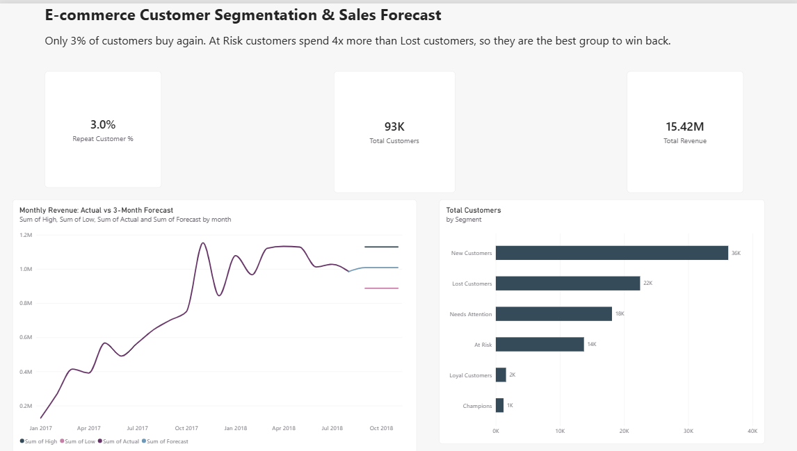
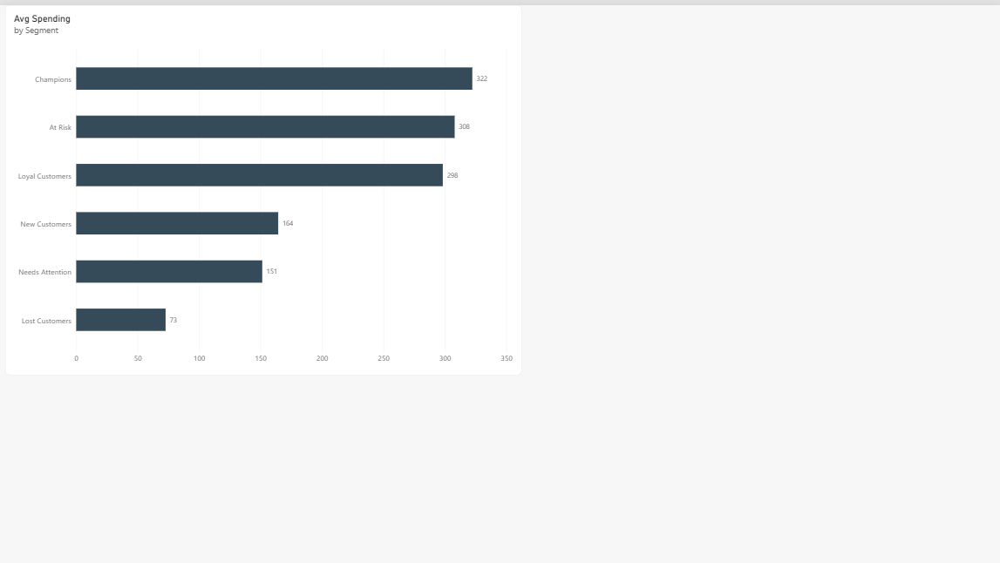

# E-commerce Customer Segmentation (RFM) & Sales Forecast

An end-to-end analytics project on the Olist Brazilian e-commerce dataset. It answers two business questions:

1. **Who are our customers, and which ones are worth winning back?** (RFM segmentation)
2. **How much will we sell in the next 3 months?** (revenue forecast with a tested baseline)

**Tools:** Python (Pandas, NumPy, Matplotlib), Power BI (DAX), Jupyter Notebook

---

## Dashboard




---

## Key Findings

- **Only 3.0% of customers ever buy again.** Of 93,357 customers, 90,556 bought once (about 97%).
- **At Risk customers are the best group to win back.** They spend about 308 BRL on average, roughly 4x more than Lost customers (about 73 BRL), but have not bought for over a year.
- **Champions and Loyal customers together are only about 3% of the base** (1,209 and 1,592 customers).
- **Total revenue (delivered orders): about 15.42M BRL.**
- **Forecast:** about 1.01M BRL per month for Sep-Nov 2018, with a likely range of 0.89M to 1.13M BRL.

### Customer Segments

| Segment | Customers | Avg. Recency (days) | Avg. Orders | Avg. Spend (BRL) |
|---|---|---|---|---|
| New Customers | 36,224 | 90.6 | 1.0 | 164.3 |
| Lost Customers | 22,488 | 396.1 | 1.0 | 72.7 |
| Needs Attention | 18,105 | 220.5 | 1.0 | 151.3 |
| At Risk | 13,739 | 394.2 | 1.0 | 307.9 |
| Loyal Customers | 1,592 | 319.9 | 2.1 | 298.2 |
| Champions | 1,209 | 89.2 | 2.2 | 322.2 |

---

## Recommendations

1. **Win-back campaign for At Risk customers.** They have high spending value but have been inactive for over a year.
2. **Repeat-purchase program for New Customers.** The store is strong at acquiring customers but weak at retaining them. A second-order incentive could lift the 3% repeat rate.
3. **Low-cost approach for Lost Customers.** Their average spend is low, so avoid expensive offers.
4. **Reward Champions** to keep the small group of best customers.

---

## Method

### 1. Data preparation
- Loaded the Olist CSV files (orders, customers, payments).
- Kept only **delivered** orders (96,478 orders).
- Used `customer_unique_id` instead of `customer_id`, because `customer_id` changes with every order (99,441 IDs vs 96,096 real people before filtering).
- Summed payments per order and joined orders, customers and payments into one sales table.

### 2. RFM segmentation
- **Recency:** days since the last purchase (snapshot date = last order date + 1 day)
- **Frequency:** number of orders
- **Monetary:** total money paid
- Recency and Monetary were scored 1-5 using quintiles. Frequency was scored by hand (1 order = 1, up to 5+ orders = 5), because about 97% of customers bought only once.
- Segments were assigned with rule-based logic on the scores.

### 3. Revenue forecast
- Monthly revenue from **Jan 2017 to Aug 2018** (20 complete months). Earlier months had almost no sales, and no delivered orders exist after Aug 2018.
- Three methods were tested on the last 3 known months (backtest):

| Method | Error (MAPE) |
|---|---|
| Average of last 3 months (baseline) | **11.8%** |
| Straight line, last 6 months | 26.0% |
| Straight line, all months | 34.2% |

- The simple baseline won, so it was used for the forecast. The likely range is the forecast plus or minus 12%.

### 4. Dashboard
- Power BI dashboard with KPI cards (Total Customers, Total Revenue, Repeat Customer %), a revenue trend with forecast, customers by segment, and average spending by segment. Measures were written in DAX.

---

## Limitations

- Only 20 months of data and a single November, so the model **cannot learn seasonality**. The November 2018 forecast is probably too low (November 2017 had a large sales spike).
- The forecast is a simple baseline. It was chosen because it beat the straight-line methods in testing, not because it is the most advanced option.
- Data covers 2016-2018 for a Brazilian marketplace. Amounts are in BRL.

---

## Project Structure

```
ecommerce-rfm-forecasting/
├── data/
│   ├── raw/          # original Olist CSV files
│   └── processed/    # rfm_segments.csv, monthly_sales.csv, revenue_forecast.csv, revenue_trend.csv
├── notebooks/        # 01_explore_data.ipynb
├── dashboard/        # ecommerce_rfm_dashboard.pbix
├── docs/             # dashboard screenshots and charts
└── README.md
```

## Dataset

[Brazilian E-Commerce Public Dataset by Olist](https://www.kaggle.com/datasets/olistbr/brazilian-ecommerce) (Kaggle)

## Author

Muhammad Qais - [GitHub](https://github.com/qais242004) | [LinkedIn](https://linkedin.com/in/muhammad-qais-38410b326)
